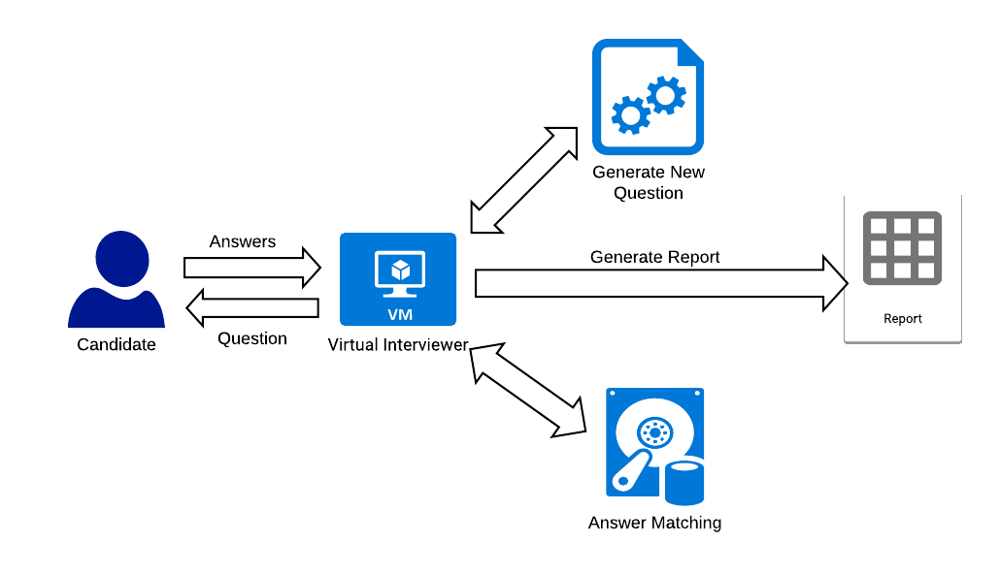
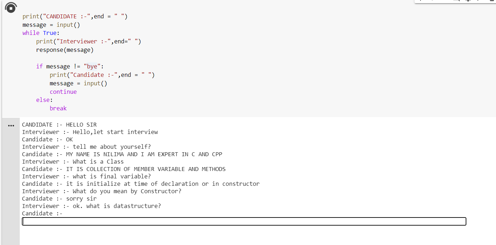

# The-Interviewer

## Problem Statement:-
To overcome the problem of hiring the bulk of candidates using human HR recruiterand automate this work using AI Interviewer and reduce human Bias nature in can-didate selection process.

## Proposed System:-
The architecture characterizes the system.   Candidate gives greetings as input.Text input is simply stored in the database for further process.  It is recognised andmatched with the commands available in the database. Once the command is found,its respective task is executed. It can also be in the form of application execution.

## Output:-

